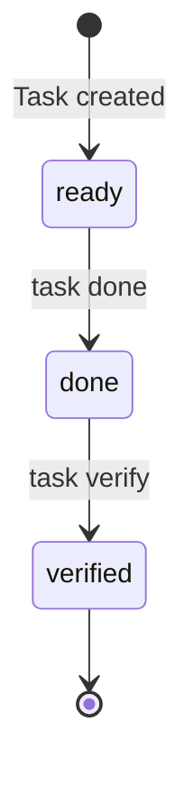

# Task Lifecycle

Tasks in Lodestar move through a defined lifecycle from creation to verification.

## Task States



### ready

Initial state when a task is created. The task is available to be claimed if:

- All dependencies are in `verified` status
- No active lease exists

### done

Work is complete. The agent has finished the implementation.

### verified

The task has been tested and confirmed working. Dependent tasks can now be claimed.

## State Transitions

| From | To | Command | Who Can Do It |
|------|-----|---------|---------------|
| ready | done | `task done` | Agent with active lease |
| done | verified | `task verify` | Any agent |

## Claiming vs Status

Claiming (leases) and status are orthogonal:

- **Claiming**: Who is currently working on a task
- **Status**: What stage the task is in

A task can be:

- `ready` + unclaimed = available to work on
- `ready` + claimed = someone is working on it
- `done` + unclaimed = waiting for verification
- `verified` = complete

## Example Workflow

```bash
# Find claimable tasks
lodestar task next

# Claim and work
lodestar task claim F001
# ... do the work ...

# Mark complete
lodestar task done F001

# Verify (can be done by same or different agent)
lodestar task verify F001
```
